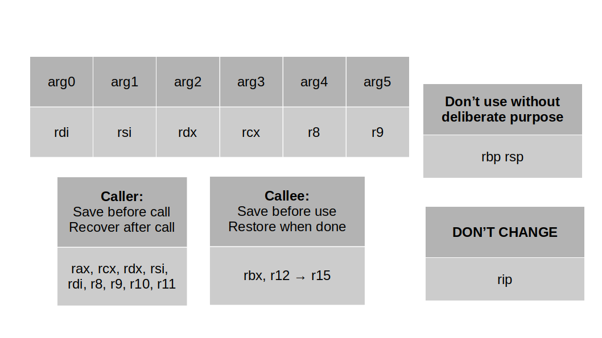

# References  
- This document serves to compile a comprehensive list of valuable links and references covering various programming topics."
## Table Of Contents
1. [General References](#general-references)
1. [C Programming References](#c-programming-references)
1. [Assembly References](#assembly-references)
1. [Create code.level.up Local Repo](#create-codelevelup-local-repo)
1. [Create Secured RDP Gateway Ubuntu](#create-secured-rdp-gateway-ubuntu)
1. [Scrum References](#scrum-references)

## General References
1. Beej's Guide: https://beej.us/guide/
2. Black Wasp: https://www.blackwasp.co.uk/

## C Programming References
1. Mead's Guide to getopt: [Click Here](https://azrael.digipen.edu/~mmead/www/Courses/CS180/getopt.html)

## Assembly References

## Create code.level.up Local Repo
1.  Log into your account at: https://code.levelup.cce.af.mil/
2.  Create access token:
    - goto Preferences > Access Tokens > Add new token
    - give token a name, select scopes, then create personal access token.
    - save your access token (you won't see it again and need it when you clone the repo)
3. Clone repository:
    - git -c http.sslVerify=false clone http://path/to/repo
    - change directory into repository
    - git config http.sslVerify "false"

## Create Secured RDP Gateway Ubuntu
Purpose: This section contains resources for creating a RDP gateway using Apache Guacamole, then creating a secured tunnel using CloudFlare using Ubuntu.

1. Create RDP Gateway using Apache Guacamole Ubuntu: [Click Here](https://www.atlantic.net/dedicated-server-hosting/how-to-create-remote-desktop-gateway-via-apache-guacamole-on-ubuntu-22-04/)

2. Create cloudflare account: [Click Here](https://www.cloudflare.com/)
3. Add site to cloudflare: [Click Here](https://developers.cloudflare.com/fundamentals/setup/manage-domains/add-site/)
4. Change your nameservers: [Click Here](https://developers.cloudflare.com/dns/zone-setups/full-setup/setup/)
5. Set up a tunnel through the dashboard: [Click Here](https://developers.cloudflare.com/cloudflare-one/connections/connect-networks/get-started/create-remote-tunnel/)

## Scrum References
1. Agile Manifesto: [Click Here](https://agilemanifesto.org/)
1. 2020 Scrum Guide: [Click Here](https://scrumguides.org/docs/scrumguide/v2020/2020-Scrum-Guide-US.pdf)