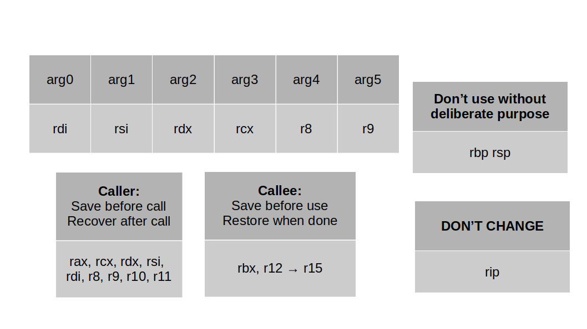

# References  
- This document serves to compile a comprehensive list of valuable links and references covering various programming topics."
## Table Of Contents
1. [General References](#general-references)
1. [Pre-Commit Setup and Use](#pre-commit-setup-and-use)
1. [C Programming References](#c-programming-references)
1. [Assembly References](#assembly-references)
1. [Create code.level.up Local Repo](#create-codelevelup-local-repo)
1. [Create Secured RDP Gateway Ubuntu](#create-secured-rdp-gateway-ubuntu)
1. [Scrum References](#scrum-references)

## General References
1. Beej's Guide: https://beej.us/guide/
2. Black Wasp: https://www.blackwasp.co.uk/

## Pre-Commit Setup and Use
This section will explain how to configure and use Python's pre-commit framework.

Reference: https://pre-commit.com/

1. Ensure you have Python installed on your system: https://www.python.org/downloads/
2. Install pre-commit using ```pip install pre-commit```
3. Add a `.pre-commit-config.yaml` to top level of project directory (example below)
4. Add you ```.clang-format``` file to top level of project directory
4. From the top-level of your project directory, run ```pre-commit install``` to install the git hook scripts.
5. Once successfully installed, anytime you commit changes to git, pre-commit will change your specified formatting settings.

```
**Example .pre-commit-config.yaml:**
# Configuration File for Pre-Commit Hooks
# exclude: Docs/

repos:
- repo: https://github.com/pre-commit/pre-commit-hooks
  rev: v4.4.0
  hooks:
  - id: check-merge-conflict
  - id: check-yaml
  - id: end-of-file-fixer
  - id: mixed-line-ending
  - id: trailing-whitespace

# C Hooks
# intentionally left blank

# Clang-Format
- repo: https://github.com/pre-commit/mirrors-clang-format
  rev: v17.0.4
  hooks:
  - id: clang-format
    args: ['--style=file']
```

## C Programming References
1. Mead's Guide to getopt: [Click Here](https://azrael.digipen.edu/~mmead/www/Courses/CS180/getopt.html)

## Assembly References
1. Felix Cloutier Instruction Reference: [Click Here](https://www.felixcloutier.com/x86/)



## Create code.level.up Local Repo
**NOTE:** Ensure your git config is properly setup.
```
git config --global user.name "user.name"
git config --global user.email "youremail@something.com"
```
1.  Log into your account at: https://code.levelup.cce.af.mil/
2.  Create access token:
    - goto Preferences > Access Tokens > Add new token
    - give token a name, select scopes, then create personal access token.
    - save your access token (you won't see it again and need it when you clone the repo)
3. Clone repository:
    - git -c http.sslVerify=false clone http://path/to/repo
    - change directory into repository and run the following:
  ```
   git config http.sslVerify "false"
  ```

## Create Secured RDP Gateway Ubuntu
Purpose: This section contains resources for creating a RDP gateway using Apache Guacamole, then creating a secured tunnel using CloudFlare using Ubuntu.

1. Create RDP Gateway using Apache Guacamole Ubuntu: [Click Here](https://www.atlantic.net/dedicated-server-hosting/how-to-create-remote-desktop-gateway-via-apache-guacamole-on-ubuntu-22-04/)

2. Create cloudflare account: [Click Here](https://www.cloudflare.com/)
3. Add site to cloudflare: [Click Here](https://developers.cloudflare.com/fundamentals/setup/manage-domains/add-site/)
4. Change your nameservers: [Click Here](https://developers.cloudflare.com/dns/zone-setups/full-setup/setup/)
5. Set up a tunnel through the dashboard: [Click Here](https://developers.cloudflare.com/cloudflare-one/connections/connect-networks/get-started/create-remote-tunnel/)

## Scrum References
1. Agile Manifesto: [Click Here](https://agilemanifesto.org/)
1. 2020 Scrum Guide: [Click Here](https://scrumguides.org/docs/scrumguide/v2020/2020-Scrum-Guide-US.pdf)
